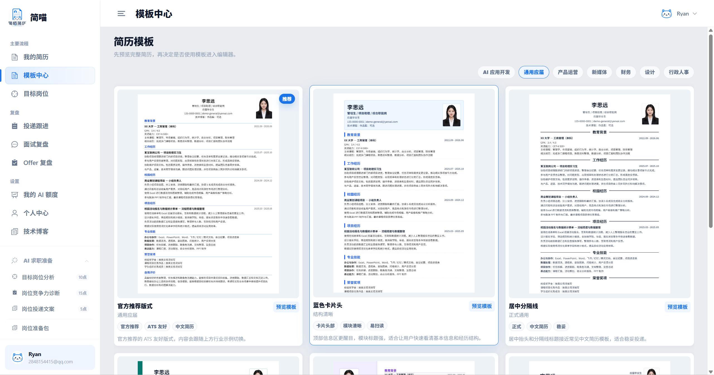
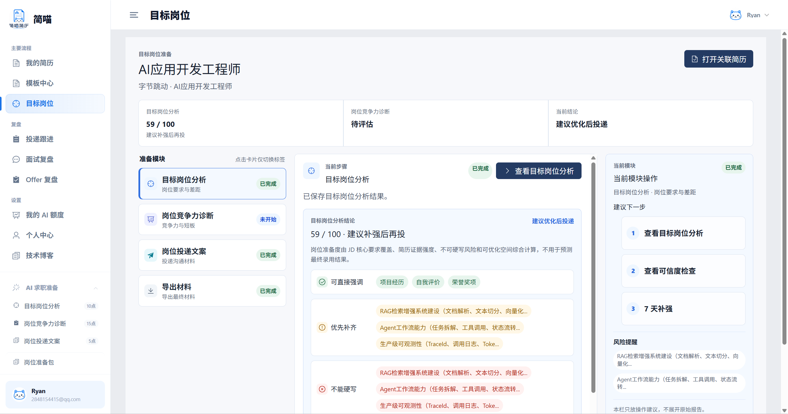
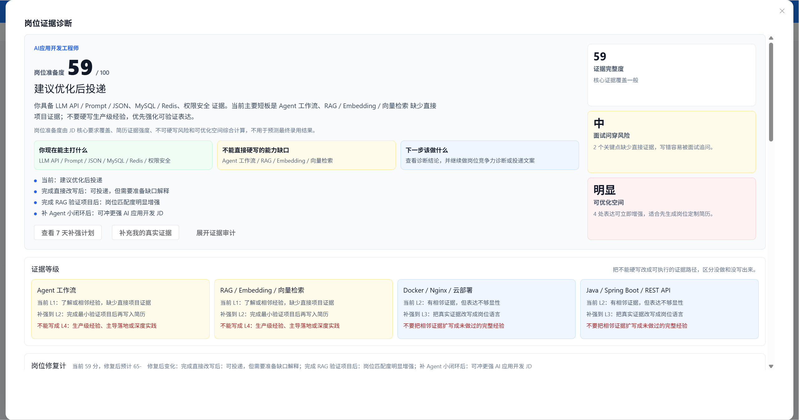
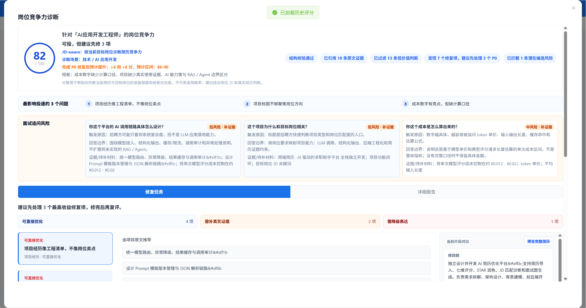
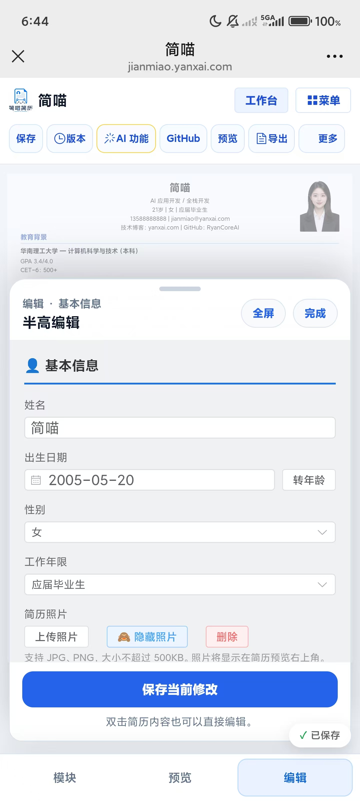
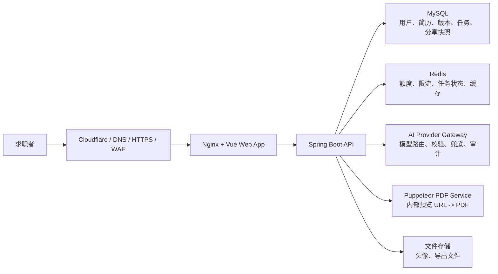

# 简喵 JianMiao

> 基于真实经历对齐岗位要求，让每一次匹配判断都有依据、边界和可追溯证据。

[在线体验](https://jianmiao.yanxai.com) · [技术博客](https://yanxai.com) · [安全与隐私说明](docs/SECURITY-AND-PRIVACY.md) · [部署架构概览](docs/DEPLOYMENT-OVERVIEW.md)

## 仓库说明

这是 **简喵 JianMiao 的产品展示与文档仓库**，用于公开介绍产品定位、核心流程、截图、架构思路和安全边界。

为避免源码被直接复制、二次商用或绕过安全边界复刻，本仓库 **不包含**：

- 前端源码
- 后端源码
- AI Prompt / Schema / Eval 细节
- Docker Compose / Nginx / 生产部署脚本
- 数据库迁移文件
- 生产配置、密钥、日志、用户数据

如果你想体验产品，请直接访问：[https://jianmiao.yanxai.com](https://jianmiao.yanxai.com)。

## 一句话定位

简喵不是单纯的简历模板工具，而是围绕一个目标岗位，帮助求职者完成：

```text
简历模板 / 编辑 -> 目标岗位分析 -> 岗位竞争力诊断 -> 岗位投递文案 -> PDF 导出
```

核心目标是把“我做过什么”整理成“这个岗位为什么可以投”，同时明确哪些内容可以写、哪些内容需要补证据、哪些内容不能硬写。

## 为什么做

很多学生和早期求职者不是没有经历，而是不知道怎么把经历翻译成岗位语言。

常见问题包括：

- 简历像流水账，看不出岗位相关性。
- JD 要求很多，但不知道自己哪些能对上。
- 为了匹配岗位，容易把 JD 要求误写成自己的经历。
- 免费模板能解决排版，但解决不了“能不能投、怎么改、哪些不能写”。
- 传统 AI 生成文案很快，但经常不给证据边界，用户很难判断是否可信。

简喵希望做的是“投递前检查型 AI 求职助手”：先尊重真实经历，再做岗位对齐。

## 核心能力

### 1. 简历模板与编辑

提供多种中文简历模板，支持桌面端和移动端编辑、预览、版本保存、头像上传、GitHub 项目导入和 PDF 导出。



### 2. 目标岗位分析

粘贴目标 JD 后，系统会拆解岗位要求，判断简历中哪些内容有证据、哪些是缺口、哪些不能硬写。



### 3. 岗位证据诊断

把 JD 要求和简历事实分开处理：JD 是岗位要求，不是候选人事实。系统会输出可强化项、需补证据项、不可硬写项和下一步建议。



### 4. 岗位竞争力诊断

不是简单给一个“录用概率”，而是从证据完整度、可投递程度、面试追问风险和修复优先级去判断当前简历是否适合这个岗位。




### 5. 移动端编辑体验

移动端保留保存、版本、AI 功能、GitHub 导入、预览、导出等核心操作；模块、预览、编辑使用底部入口切换，降低小屏幕操作成本。



## 产品差异点

| 能力 | 简喵的处理方式 |
|---|---|
| JD 分析 | 先拆岗位要求，再判断简历证据是否支撑 |
| AI 生成 | 不把 JD 要求直接写成候选人经历 |
| 风险提示 | 标注可写、需补证据、不能硬写和面试追问风险 |
| 投递文案 | 基于当前简历证据和目标岗位生成，不凭空写公司名或经历 |
| PDF 导出 | 编辑、诊断、人工确认后导出，不在最后一步卡付费 |
| 移动端 | 支持查看、编辑、预览和导出，而不是只做桌面端壳子 |

## 高层架构

下面是公开层面的架构图，只展示组件边界，不包含私有接口实现、Prompt 细节、数据库表结构或生产部署配置。



## 安全与隐私边界

简喵处理的是简历、JD 和求职材料，属于高敏感个人数据。当前设计重点包括：

- 登录态使用 HttpOnly Cookie，配合 CSRF 双提交 Token。
- 简历富文本前后端双重净化，避免 XSS。
- 简历、版本、岗位会话、PDF、分享等资源按用户归属或 Token 校验。
- 头像上传限制大小、类型和文件签名，并重新编码。
- PDF 服务只允许访问后端构造的内部预览地址，不开放任意 URL 转 PDF。
- AI 输出进入展示、保存、分享、PDF 前需要校验和兜底。
- 分享链接使用随机 Token，可撤销；短链接只是展示层，不使用自增 ID。

详细说明见：[docs/SECURITY-AND-PRIVACY.md](docs/SECURITY-AND-PRIVACY.md)。

## 部署说明

当前线上服务采用私有部署。公开仓库不提供可直接复刻的源码和生产部署文件。

公开可说明的部署边界：

- ECS / Docker Compose 承载应用服务。
- Cloudflare 提供 DNS、HTTPS、基础 WAF 和边缘分析。
- MySQL / Redis 不暴露公网。
- 生产 `.env` 只存在服务器本地，不进入仓库。
- 生产数据库从空库迁移开始，不上传本地测试数据。
- 上传文件和导出文件使用服务端存储并定期备份。

详细说明见：[docs/DEPLOYMENT-OVERVIEW.md](docs/DEPLOYMENT-OVERVIEW.md)。

## 适合谁

简喵更适合这些场景：

- 已经有简历，但不知道怎么对齐某个 JD。
- 项目经历真实，但表达不够像岗位语言。
- 想知道哪些内容能写、哪些需要补证据、哪些不能硬写。
- 需要在投递前快速生成一版可检查的 PDF。
- 希望 AI 给建议，但不希望 AI 编经历。

不适合这些场景：

- 希望系统自动伪造经历。
- 希望用一份空简历直接生成高匹配简历。
- 希望系统承诺录用概率。
- 希望绕过人工核对直接批量投递。

## 当前状态

简喵已上线熟人内测版本，重点验证四段主链路：

- [x] 简历模板与编辑
- [x] 目标岗位分析
- [x] 岗位竞争力诊断
- [x] 岗位投递文案
- [x] PDF 导出
- [x] 移动端基础编辑与预览
- [ ] 更多行业模板
- [ ] 更完整的隐私说明页
- [ ] 更稳定的移动端长文本编辑体验
- [ ] 更多真实用户反馈后的行业化优化

## 反馈

如果你在使用中遇到问题，或希望增加某类模板、行业示例、求职场景，可以通过 [yanxai.com](https://yanxai.com) 联系我。

请不要在公开 Issue 中粘贴真实简历、真实 JD、手机号、邮箱、身份证件、公司内部材料或任何密钥。

## 使用与授权

本仓库不是开源源码仓库。代码、产品流程、品牌、截图、文档和部署方案的授权边界见 [LICENSE](LICENSE)。
