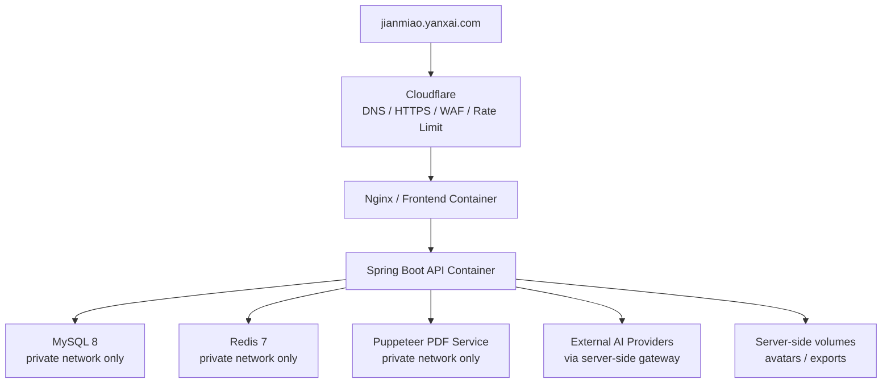

# 简喵部署架构概览

> 这是公开层面的部署说明，不包含源码、生产配置、密钥、数据库迁移、Docker Compose 文件或 Nginx 完整配置。

## 部署目标

简喵当前按小规模内测和个人维护场景设计，优先保证：

- 生产密钥不进入仓库。
- MySQL、Redis、Puppeteer 等内部服务不暴露公网。
- PDF 导出、AI 调用、上传、分享等高风险入口有边界。
- 出问题时能通过任务号、日志和容器状态定位。

## 高层组件

## 网络边界

生产环境原则：

- 公网只开放 80 / 443。
- SSH 只允许受控管理 IP。
- MySQL、Redis、Puppeteer、后端内部端口不开放公网。
- 入口只接受预期 Host。
- Cloudflare 切换代理后，源站应逐步收紧为只接受 Cloudflare IP 段或受控负载均衡入口。

## 环境变量

生产密钥只应存在服务器本地 `.env` 或受控 Secret 管理系统中，不能提交到 Git。

常见变量类别：

- 数据库密码
- Redis 密码
- JWT / Cookie / CSRF 相关密钥
- 管理后台审计加密密钥
- 备份加密口令
- AI Provider API Key
- GitHub OAuth Client Secret
- 邮件服务凭据

公开文档只列变量类别，不提供真实值。

## 数据库与文件

上线原则：

- 不上传本地数据库到服务器。
- 生产库从空库初始化，并执行正式迁移。
- 上传文件、头像、导出 PDF 放在服务端受控目录或对象存储中。
- 上传目录和数据库必须做加密备份。
- 导出文件应设置保留周期，避免磁盘无限增长。

## PDF 导出链路

PDF 导出不是直接让用户提交 URL，而是：

1. 后端生成受控的内部预览 URL。
2. Puppeteer 服务只访问白名单主机。
3. 页面渲染完成后生成 PDF。
4. 用户通过任务 ID 查询状态并下载。

核心防护：

- 异步队列，避免同步请求卡死。
- 用户 / IP 限流，避免被刷爆。
- Puppeteer 只访问允许的内部地址。
- 阻断 `file:`、`ws:`、metadata IP、非白名单 host。
- 失败时返回可读错误，并保留浏览器导出兜底。

## AI 调用链路

AI 相关请求必须走后端网关：

- 前端不持有模型 API Key。
- 后端统一做额度、限流、缓存、错误兜底和审计。
- JD 文本只能作为岗位要求，不能直接转写成候选人事实。
- AI 输出进入数据库、分享、PDF 或 HTML 展示前必须校验。

## Cloudflare 角色

Cloudflare 用于：

- DNS
- HTTPS
- 基础 WAF
- Bot / Browser Integrity 类规则
- 登录、AI、PDF、分享等入口的速率限制
- 访问分析

Cloudflare 不保存生产数据库，不保存模型密钥，不替代后端鉴权。

## 不公开的内容

以下内容不会放入本仓库：

- 前后端源码
- Prompt 模板
- Schema / Eval 数据集
- Docker Compose / Nginx 完整配置
- 数据库迁移文件
- 生产 `.env`
- 用户数据、日志、备份文件

